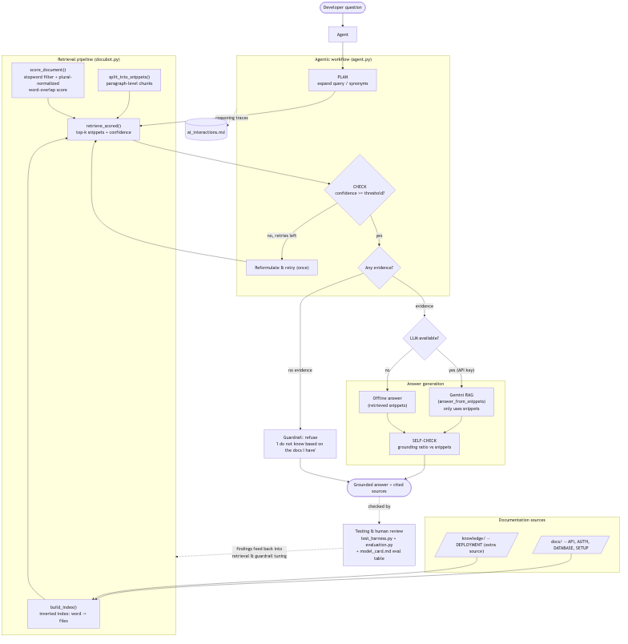

# DocuBot — Applied AI System

A grounded documentation assistant that answers developer questions about a
codebase using **Retrieval-Augmented Generation (RAG)**, an **agentic
self-checking workflow**, and explicit **guardrails** that refuse to answer when
the documentation does not support a confident response.

> **Original project (Module 4 Tinker — DocuBot).** DocuBot began as a Tinker
> exercise that compared three ways of answering questions over a local docs
> folder: naive LLM generation, a hand-built retrieval system, and RAG. Its
> original goal was to show *why retrieval matters* — that grounding an LLM in
> retrieved snippets reduces hallucination compared to sending it the whole
> corpus and hoping. This project extends that foundation into a fuller applied
> system with multi-source retrieval, an agentic loop, a reliability test
> harness, and responsible-AI documentation.

---

## What it does

DocuBot takes a natural-language developer question (e.g. *"Where is the auth
token generated?"*) and returns an answer grounded in a local documentation
corpus — or an honest **"I do not know based on the docs I have"** when the docs
don't cover it. It runs in four modes so you can see the difference retrieval
and agency make:

| Mode | Name | What happens | Needs API key |
|------|------|--------------|:---:|
| 1 | Naive LLM | Sends the question to Gemini with no retrieval | Yes |
| 2 | Retrieval only | Your index + scorer return snippets, no LLM | No |
| 3 | RAG | Retrieve first, then Gemini answers **using only** those snippets | Yes |
| 4 | **Agentic workflow** | Plan → retrieve → self-check → retry/refuse, with reasoning traces | No (better with) |

**Required AI feature:** Retrieval-Augmented Generation (Mode 3), fully
integrated — the retrieved snippets are the *only* context the model is allowed
to use, and drive whether it answers or refuses.

---

## Architecture overview



Source diagram: [`diagrams/architecture.mmd`](diagrams/architecture.mmd) (Mermaid).

Data flows **input → process → output** as follows:

1. **Sources.** Documentation is loaded from two folders — `docs/` (API, auth,
   database, setup) and `knowledge/` (deployment) — and indexed together
   (multi-source RAG).
2. **Retrieval pipeline** (`docubot.py`). An inverted index narrows to candidate
   files; documents are split into paragraph-sized **snippets**; each snippet is
   scored by stopword-filtered, plural-normalized word overlap; the top-k
   snippets are returned **with a confidence score**.
3. **Agentic loop** (`agent.py`). Plans query variants, retrieves, and **checks
   its own confidence**. If confidence is low it reformulates (synonym
   expansion) and retries once; if there is no evidence at all it **refuses**.
4. **Generation.** With an API key, Gemini answers using only the snippets
   (RAG); without one, the system answers directly from the snippets so the
   pipeline stays reproducible offline. A **self-check** measures how well the
   answer is grounded in the retrieved evidence.
5. **Checking.** Outputs are verified by an automated **test harness**
   (`test_harness.py`), a retrieval evaluator (`evaluation.py`), and a human
   evaluation table in `model_card.md`. Reasoning traces are logged to
   `ai_interactions.md`.

---

## Setup

Requires **Python 3.9+**.

```bash
# 1. Install dependencies
pip install -r requirements.txt

# 2. (Optional) configure the LLM. Modes 2 and 4 work without this.
cp .env.example .env        # then edit .env:
# GEMINI_API_KEY=your_api_key_here
```

Get a key at https://aistudio.google.com/app/api-keys. Without a key, retrieval
(Mode 2), the agentic workflow (Mode 4), and all tests still run.

### Run the app

```bash
python main.py          # interactive: choose mode 1-4, then a query
```

### Run the tests (no API key needed)

```bash
python test_harness.py  # reliability harness: pass/fail + confidence summary
python evaluation.py    # retrieval hit-rate over sample queries
```

---

## Sample interactions

**1. RAG / agentic answer (grounded):**

```
Question: Where is the auth token generated?
Answer:   Tokens are created by the generate_access_token function in
          auth_utils.py, signed using the AUTH_SECRET_KEY environment variable.
          (Source: docs/AUTH.md)
```

**2. Guardrail refusal (out of scope):**

```
Question: Is there any mention of payment processing?
Answer:   I do not know based on the docs I have.
```

There is no payment documentation, so DocuBot refuses instead of guessing.

**3. Multi-source retrieval (RAG enhancement):**

```
Question: What is the rate limit on public endpoints?
Answer:   Each client IP is allowed 100 requests per minute; exceeding it
          returns HTTP 429 with a Retry-After header. (Source: knowledge/DEPLOYMENT.md)
```

This answer comes from the extra `knowledge/` source. **Before** it was added,
the same question returned only a vague API-overview snippet — see the
before/after in [`model_card.md`](model_card.md).

**4. Agentic reformulation (self-correction):**

```
Question: Tell me about the db
PLAN:  ['Tell me about the db', 'tell me about db database']
ACT (attempt 1): confidence=1  -> too low, reformulating
ACT (attempt 2): 'db database' -> confidence=2  -> answer
```

The docs say "database", not "db"; the agent detects the weak first result and
retries with a synonym. Full traces: [`ai_interactions.md`](ai_interactions.md).

---

## Design decisions

- **Paragraph-level snippets over whole documents.** Returning whole files
  buried the answer and wasted the model's context. Splitting on blank lines
  keeps a heading with its content while staying small and citable.
- **Stopword filtering + plural normalization.** Simple word-overlap scoring is
  transparent and needs no embeddings, but naive matching drowns in filler words
  ("the", "how") and misses `token`/`tokens`. A small stopword set and a minimal
  plural rule fix the common cases while staying readable.
- **Refusal is a feature.** A zero-score retrieval returns nothing, which the
  answer layer turns into an explicit "I do not know." A confident wrong answer
  is worse than an honest refusal.
- **Offline-first agent.** Planning, retrieval, and self-checking are
  deterministic Python; the LLM is used only for the final generation step. This
  keeps the whole system reproducible and testable **without** an API key.
- **Trade-offs.** Word-overlap retrieval is fast, explainable, and dependency-free,
  but it has no semantic understanding — synonyms and intent ("users table" vs
  "user endpoints") can mislead it. A production version would add embeddings;
  here, transparency and reproducibility were the priority. See limitations in
  `model_card.md`.

---

## Testing summary

Run `python test_harness.py`. Latest result:

> **9 / 9 expected cases passed (100%); 1 documented known gap.**
> Average retrieval confidence on answerable queries: **2.43**.

The harness covers three behaviours: answerable questions surface the correct
source file (including the extra `knowledge/` source), out-of-scope questions
trigger the refusal guardrail, and the agent reaches the same decision. The one
**known gap** — "Which fields are stored in the users table?" retrieves the API
reference instead of the database doc — is a real limitation of term-frequency
scoring, tracked (not hidden) so genuine regressions stay visible. `evaluation.py`
independently reports a retrieval hit-rate of **0.75** over the sample queries.

**What I learned:** grounding is a *system* property, not a model property —
most reliability came from retrieval quality, snippet sizing, and the refusal
rule, not from any change to the LLM.

---

## Reflection & responsible AI

The graded responsible-AI reflection — how I collaborated with AI, one helpful
and one flawed AI suggestion, limitations, and misuse risks — lives in
[`model_card.md`](model_card.md).

## Project layout

```
docubot.py        Retrieval pipeline: index, scoring, snippet selection, guardrail
agent.py          Agentic workflow: plan -> retrieve -> self-check -> retry/refuse
llm_client.py     Gemini wrapper (naive + RAG prompts)
main.py           CLI: modes 1-4
test_harness.py   Reliability harness (pass/fail + confidence)
evaluation.py     Retrieval hit-rate evaluator
dataset.py        Sample queries + fallback corpus
docs/             Primary documentation source
knowledge/        Extra documentation source (RAG enhancement)
diagrams/         architecture.mmd (Mermaid source)
assets/           Rendered architecture.png
ai_interactions.md  Agent reasoning traces
model_card.md     Design, evaluation, and responsible-AI reflection
```
